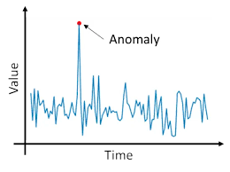
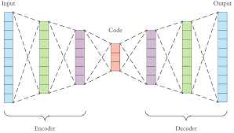
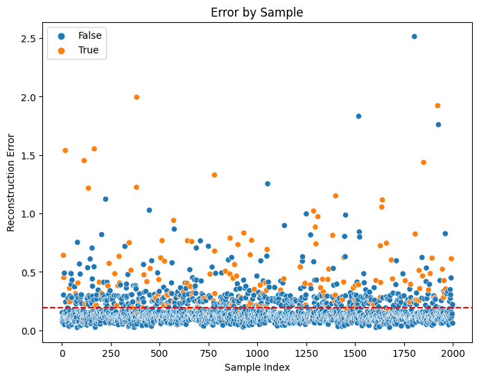

# Anomaly Detection with Autoencoders

Anomaly detection is a machine learning technique used to identify patterns in data that do not conform to expected behavior. These unexpected patterns are referred to as anomalies or outliers. Anomalies may indicate errors or fraud in the data, or they may represent unusual or interesting phenomena that warrant further investigation. Anomaly detection can be applied to a wide range of domains, including finance, cybersecurity, medical diagnosis, and predictive maintenance. There are many different methods for detecting anomalies, such as statistical approaches, clustering algorithms, and deep learning models.

Some of the most popular methods for anomaly detection include Principal Component Analysis (PCA), K-Nearest Neighbors, Isolation Forest and Ensemble methods. One popular method of Deep Learning for anomaly detection is using **Autoencoders**, which are neural networks that learn to encode and decode data. Autoencoders can be trained on a dataset of normal, non-anomalous data, and then used to identify anomalies in new data that do not match the learned patterns. Evaluation of anomaly detection models can be challenging, as anomalies are often rare events and may not be well-represented in the training data. Common evaluation metrics include precision, recall, and F1-score, and cross-validation can be used to estimate model performance on unseen data.

Anomaly detection is a powerful technique for identifying unexpected patterns in data and can provide valuable insights for many applications. However, it is important to carefully consider the limitations and assumptions of the chosen method, and to thoroughly evaluate the performance of the model on real-world data.

## Why not PCA?

Principal Component Analysis (PCA) is a dimensionality reduction technique used to transform high-dimensional data into a lower-dimensional space while retaining as much of the original variation as possible. It works by identifying the principal components of the data, which are the directions in which the data varies the most. These principal components are orthogonal to each other, and the first principal component captures the most variation in the data. PCA can also be used for anomaly detection. Anomalies in high-dimensional data can be difficult to detect due to the curse of dimensionality. PCA can be used to reduce the dimensionality of the data while retaining as much of the original variation as possible.

However, it's important to note that PCA assumes that the data is **linearly** related and that the principal components represent meaningful features. It may not be effective for highly nonlinear data or for data with complex relationships between the features. Additionally, PCA may not be effective for identifying rare anomalies if the normal pattern dominates the data.

## Say hello to - Autoencoders

Autoencoders are a type of neural network architecture that can be used for unsupervised learning, dimensionality reduction, and data compression. The goal of an autoencoder is to learn a compressed representation of the input data by encoding the input into a lower-dimensional representation, and then decoding the representation back into the original input.

Autoencoders consist of three main components: an encoder, a hidden layer(CODE) and a decoder. The encoder maps the input data to a lower-dimensional representation, while the decoder maps the lower-dimensional representation back to the original input data. The hidden layer or Code, is the lower dimension representation of the input data. During training, the network learns to minimize the difference between the input and the reconstructed output, which encourages the network to learn a compressed representation of the input. One key benefit of autoencoders is their ability to capture complex patterns in the data, including **non-linear relationships** between the features. They can be used for a variety of applications, such as image compression, anomaly detection, and generating new data.

When training an **autoencoder for anomaly detection**, the goal is to learn a compressed representation of the normal data. This compressed representation should capture the typical patterns and relationships in the normal data, so that anomalies will be identified as data points that do not fit this pattern. Once the autoencoder has been trained on the normal data, we can use it to encode new data points and compare their reconstruction error to a threshold value. If the reconstruction error exceeds the threshold, the data point is considered an anomaly. By using the autoencoder in this way, we can identify anomalies in new data without having to explicitly label the anomalies in the training data.

## Architecture

* The encoder typically consists of one or more fully connected layers that transform the input data into a lower-dimensional representation. The number of nodes in the hidden layer is typically smaller than the number of nodes in the input and output layers, which forces the network to learn a compressed representation of the input data. The activation function used in the encoder can be any non-linear function, such as a sigmoid or a rectified linear unit (ReLU), which allows the network to capture non-linear relationships in the input data.

* The decoder is typically a mirror image of the encoder, with one or more fully connected layers that transform the compressed representation back into the original input space. The output layer of the decoder should have the same number of nodes as the input layer, so that the decoder can produce a reconstruction of the input data. The activation function used in the decoder is typically the same as the one used in the encoder.

## Reconstruction

It refers to the process of using the learned compressed representation of the input data to generate a reconstruction of the original input. The reconstruction is generated by passing the compressed representation through the decoder portion of the autoencoder. The goal of the autoencoder is to learn a compressed representation of the input data that can be used to generate accurate reconstructions of the original input.

Here, `x-x'` represents the **Reconstruction Error**. 

We will start by making a prediction on the test set which consists of both classes. After this, we can define a threshold and a metric, depending upon the need. The idea is simple:
* If the Reconstruction error is lower than the threshold, the sample is `genuine`
* If the Reconstruction error is higher than the threshold, the sample is `fraud`

This is because the model was trained with samples of `genuine` class, so anything outside of this threshold is considered an anomaly.

## Result

`Recall Score: 92.063%`  \
`Accuracy Score: 77.345%`

## Conclusion
In conclusion, anomaly detection is a critical task in many fields, including finance, healthcare, and cybersecurity. Autoencoders have emerged as a powerful tool for anomaly detection due to their ability to learn compressed representations of data and generate accurate reconstructions of the original input. By training an autoencoder on normal data and using it to reconstruct new data points, anomalies can be identified based on the magnitude of their reconstruction error. However, choosing the right threshold for the reconstruction error is crucial to balance the tradeoff between detecting anomalies and generating false positives. Overall, autoencoders provide a promising approach for anomaly detection that can be applied to a wide range of domains and applications. 
